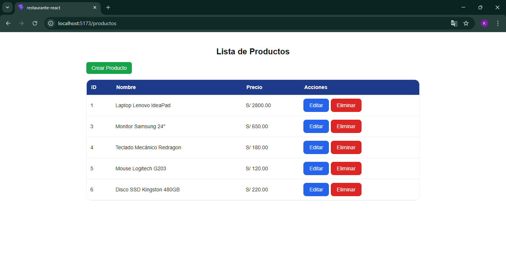
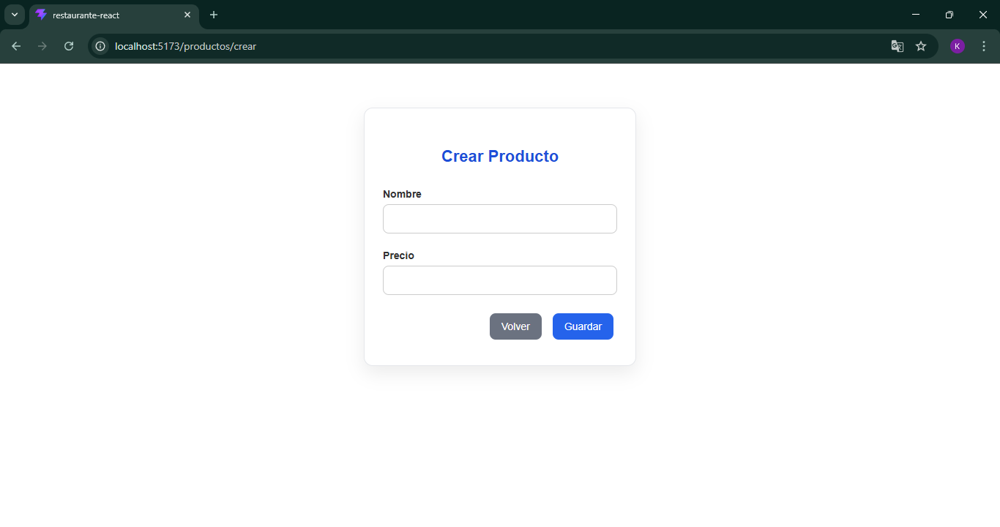
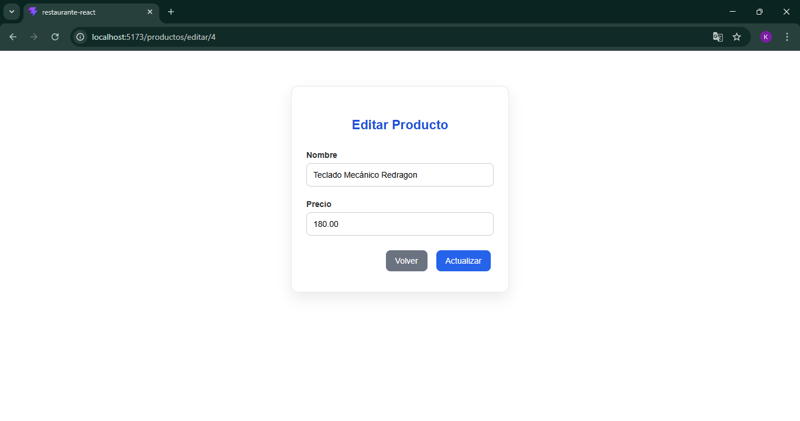

# Gestión de Productos - React + Express

## Descripción
Aplicación web CRUD desarrollada con React en el frontend y Express.js en el backend. Permite gestionar productos mediante operaciones de crear, listar, editar y eliminar, utilizando una API REST y base de datos MySQL.

---

## Capturas del proyecto

### Lista de productos

### Registro de producto

### Edición de producto

---

## Tecnologías utilizadas

- React
- JavaScript
- Express.js
- API REST
- MySQL
- HTML / CSS
- Git / GitHub

---

## Base de datos
Se utiliza MySQL para el almacenamiento de los productos y la gestión de las operaciones CRUD mediante el backend en Express.js.

---

## Autor
Kenjyo Huancahuire Salas